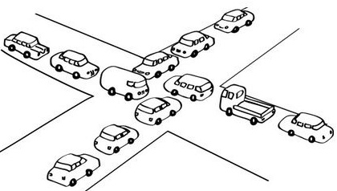

# MySQL 你好，死锁



## 前言

在日常的生活中，相信大家曾或多或少有这么一种体验："每到下班高峰期的时候，原本宽坦的交通干道，一时间变得水泄不通，司机和乘客都烦躁不安，喇叭声响成一片，当车卡在十字路口中间，会很尴尬的发现，此时无论想走哪都…..."。对于这样的体验，大家都是十分的害怕接触和体验，交通部门也无时无刻为解决交通拥堵问题而努力。

其实上面生活案例中拥堵就类似于——`高并发`场景；

而所有方向的车堵在十字路口中间就类似于——`数据库死锁`场景。

本章主要围绕`InnoDB存储引擎`死锁相关的一些概念、产生死锁的原因、死锁场景以及死锁的处理策略。


## 相关概念

为了更好的认识`死锁`，我们先来了解`MySQL`中与死锁相关的一些基本概念。

### 并发控制

并发控制（Concurrency control）指的是当多个用户同时更新运行时，用于保护数据库完整性的各种技术。

#### 读写锁

为了保证数据库的并发控制，因此`MySQL`设置了两种锁：

- 共享锁（Shared Lock）：也叫读锁（Read Lock），允许多个连接可以同一时刻并发的读取同一资源，互不干扰
- 排他锁（Exclusive Lock）：也叫写锁（Write Lock），会阻塞其他写锁或者读书的请求，保证同一时刻只有一个连接可以操作数据，包括读

#### 锁策略

所谓`锁策略`就是在锁的开销和数据的安全性之间寻求平衡，这种平衡会影响到性能。目前`InnoDB存储引擎`有以下两种锁策略：

 - Table Lock（表锁）策略：最基本的锁策略，开销最小，加锁快，不会出现死锁，但发生锁冲突概率高，粒度大，并发低
 - Row Lock（行锁）策略：粒度最小，发生锁冲突态度低，并发也高，但是开销大，加锁慢，会出现死锁

### 事务

所谓事务，它是一个操作序列，这些操作要么都执行，要么都不执行，它是一个不可分割的工作单位。一个`事务`是需要通过严格ACID测试的：

- 原子性(ATOMICITY)：一个事务的整个操作，要么全部提交成功，要么全部失败回滚，不能执行其中的某一部分
- 一致性(CONSISTENCY)：数据库总是从一个一致性的状态转换到另外一个一致性的状态
- 隔离性(ISOLATION)：一个事物所作的修改在提交前，其他事务是看不到的
- 持久性(DURABILITY)：一旦事务提交，则其所做的修改就会永久保存到数据库中

#### 隔离级别

SQL标准制定了四种隔离级别，规定事务的修改对其它事务是否可见

- READ UNCOMMITED（未提交读）：未提交也可见，又称`脏读`

- READ COMMITED （提交读）：只有提交才可见，大多数DBMS默认隔离级别都是这个，MySQL不是，也称不可重复读

- REPEATABLE READ （可重复读），多次重复读取结果一致，MySQL默认这个级别，解决`脏读`问题，但存在`幻读`问题（某个事务读取记录时，另一事务插入了新纪录，原事务再读取记录时产生幻行）。

- SERIALIZABLE （可串行化），最高隔离级别，强制事务串行执行，避免了前面说的幻读问题，并发性能差

| 隔离级别        | 脏读可能性 | 不可重复读可能性 | 幻读可能性 | 加锁读 |
| --------------- | ---------- | ---------------- | ---------- | ------ |
| READ UNCOMMITED | Yes        | Yes              | Yes        | No     |
| READ COMMITED   | No         | Yes              | Yes        | No     |
| REPEATABLE READ | No         | No               | Yes        | No     |
| SERIALIZABLE    | No         | No               | No         | Yes    |


## 死锁的定义

死锁是指`两个或多个事务`在同一资源上相互占用，并请求`锁定`对方占用的资源（我等待你的资源，你却等待我的资源，我们都相互等待，谁也不释放自己占有的资源），从而导致恶性循环的现象：

- 当多个`事务`试图以不同顺序锁定资源时，就可能会产生死锁
- 多个`事务`，同时`锁定`同一个资源时，也会产生死锁


## 死锁的危害

死等和死锁可不是一回事，如果你遇到了死等，大可放心，肯定不是死锁；如果发生了死锁，也大可放心，绝对不会死等。

这是因为`MySQL`内部有一套死锁检测机制，一旦发生死锁会立即回滚一个事务，让另一个事务执行下去。并且这个死锁回滚的的错误消息也会发送给客户端。即使正常的业务中，死锁也时不时会发生，所以遇到死锁不要害怕，因为这也是对数据安全的一种保护，但是若死锁太频繁，那可能会带来许多的问题：

1. 使进程得不到正确的结果：处于死锁状态的进程得不到所需的资源，不能向前推进，故得不到结果

2. 使资源的利用率降低：处于死锁状态的进程不释放已占有的资源，以至于这些资源不能被其他进程利用，故系统资源利用率降低

3. 导致产生新的死锁：其它进程因请求不到死锁进程已占用的资源而无法向前推进，所以也会发生死锁


## 死锁产生的原因

死锁有四个必要的条件：

1. 互斥排他：一个资源每次只能被一个进程使用
2. 保持着排他资源又提出新资源请求：一个进程因请求资源而阻塞时，对已获得的资源保持不放
3. 不可剥夺：资源不能被抢占，即资源只能在进程完成任务后自动释放
4. 环路：有一组等待进程｛P0、P1、P2｝，`P0`等待的资源被`P1`所占有，`P1`等待的资源被`P2`所占有，而`P2`等待的又被`P0`所占有，形成了一个等待循环


## 死锁的发生场景

以下的所有场景是基于 `InnoDB存储引擎`并且隔离级别为`REPEATABLE-READ`（可重复读）

**查询当前的隔离级别：**

```mysql
select @@global.tx_isolation,@@tx_isolation;
```

```mysql
+-----------------------+-----------------+
| @@global.tx_isolation | @@tx_isolation  |
+-----------------------+-----------------+
| REPEATABLE-READ       | REPEATABLE-READ |
+-----------------------+-----------------+
```

**修改隔离级别：**

```mysql
set global transaction isolation level read committed; ## 全局的

set session transaction isolation level read committed; ## 当前会话(session)
```

**创建数据表**

```mysql
CREATE TABLE `deadlock` (
  `id` int(11) NOT NULL,
  `stu_num` int(11) DEFAULT NULL,
  `score` int(11) DEFAULT NULL,
  PRIMARY KEY (`id`),
  UNIQUE KEY `idx_uniq_stu_num` (`stu_num`),
  KEY `idx_score` (`score`)
) ENGINE=InnoDB;

insert into deadlock(id, stu_num, score) values (1, 11, 111);
insert into deadlock(id, stu_num, score) values (2, 22, 222);
insert into deadlock(id, stu_num, score) values (3, 33, 333);
```

`id`主键索引

`stu_num` 为唯一索引

`score`普通索引


为了模拟实际场景，需要在每个会话（session）中执行以下两条命令：

```mysql
set autocommit=0; ## 关闭自动提交

START TRANSACTION; ## 开始事务
```


### 场景一：AB BA

```mysql
# session A
select * from deadlock where id = 1 for update; 

# session B
select * from deadlock where id = 2 for update; 

# session A
select * from deadlock where id = 2 for update;
## 因为session2 已经给id=2分配了写锁

# session B
select * from deadlock where id = 1 for update;
## 1213 - Deadlock found when trying to get lock; try restarting transaction
```


### 场景二：同一个事务中，S-lock 升级为 X-lock

```mysql
# session A
SELECT * FROM deadlock WHERE id = 1 LOCK IN SHARE MODE;   
## 获取S-Lock

# session B
DELETE FROM deadlock WHERE id = 1;   
## 想获取X-Lock，但被session A的S-lock 卡住，目前处于waiting lock阶段

# session A
DELETE FROM deadlock WHERE id = 1;   
## Error : Deadlock found when trying to get lock; try restarting transaction
## 想获取X-Lock，sessionA本身拥有S-Lock
## 但是由于sessionB 申请X-Lock再前##
## 因此sessionA不能够从S-lock 提升到 X-lock
## 需要等待sessionB 释放才可以获取，所以造成死锁

```


### 场景三：主键和二级索引的死锁

```mysql
CREATE TABLE `deadlock_A` (
  `id` int(11) NOT NULL,
  `stu_num` int(11) DEFAULT NULL,
  `score` int(11) DEFAULT NULL,
  PRIMARY KEY (`id`),
  KEY `idx_score` (`score`),
  KEY `idx_stu_num` (`stu_num`) USING BTREE
) ENGINE=InnoDB;

# deadlock_A 数据
# select * from deadlock_A
| id   | stu_num | score |
| ---- | ------- | ----- |
| 1    | 11      | 111   |
| 2    | 33      | 222   |
| 3    | 22      | 333   |
| 4    | 44      | 444   |
```


```mysql
# session A
delete from deadlock_A where stu_num > 11;
## 锁二级索引（stu_num）的顺序：22->33->44  锁主键（id）索引的顺序：3->2->4

# session B
delete from deadlock_A where score > 111;
## 锁二级索引（score）的顺序：222->333->444  锁主键（id）索引的顺序：2->3->4

## sessionA锁主键3， sessionB锁主键2
## sessionA锁主键2， sessionB锁主键3
## 死锁产生-》AB BA
## 这个在并发场景，可能会产生。
```


## 死锁的处理策略

### 预防死锁

1. 同顺序：以固定的顺序访问表和行。比如两个更新数据的事务，事务A 更新数据的顺序 为1->2；事务B更新数据的顺序为2->1。这样更可能会造成死锁

- 尽量保持事务简短：大事务更倾向于死锁，如果业务允许，将大事务拆小
- 一次性锁定：在同一个事务中，尽可能做到一次锁定所需要的所有资源，减少死锁概率
- 降低隔离级别：如果业务允许，将隔离级别调低也是较好的选择，比如将隔离级别从RR调整为RC，可以避免掉很多因为gap锁造成的死锁
- 细粒度锁定（行锁）：为表添加合理的索引。可以看到如果不走索引将会为表的每一行记录添加上锁，死锁的概率大大增大


### 死锁的检测和解除

**innodb_lock_wait_timeout 等待锁超时回滚事务：** 
直观方法是在两个事务相互等待时，当一个等待时间超过设置的某一阀值时，对其中一个事务进行回滚，另一个事务就能继续执行。这种方法简单有效，在innodb中，参数innodb_lock_wait_timeout用来设置超时时间。

**wait-for graph算法来主动进行死锁检测：** 
innodb还提供了wait-for graph算法来主动进行死锁检测，每当加锁请求无法立即满足需要并进入等待时，wait-for graph算法都会被触发。

## 参考文章

《高性能的MySQL 第三版》

http://hedengcheng.com/?p=771#_Toc374698322

https://www.kancloud.cn/hanghanghang/os/239542#_38

https://blog.csdn.net/dqjyong/article/details/8046397


