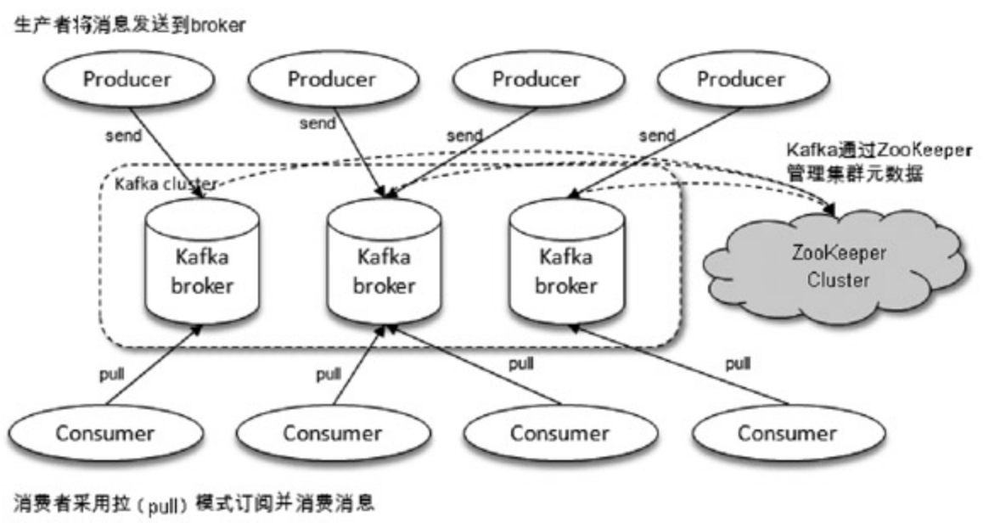
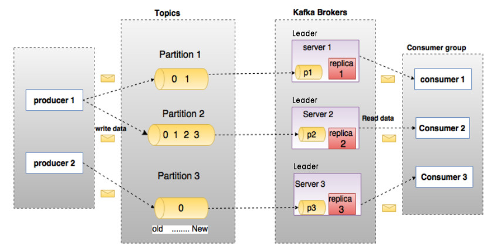
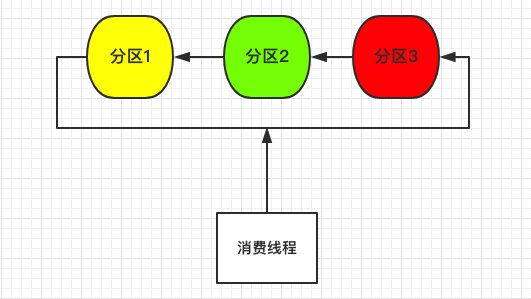
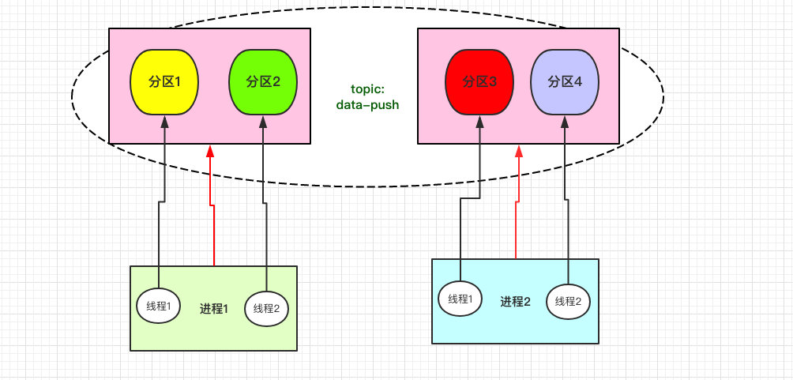
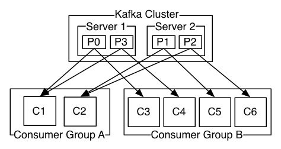

# Kafka基本架构和命令


## Kafka体系架构



### Broker服务代理节点

服务代理节点。对于Kafka而言，Broker可以简单地看作一个独立的Kafka服务节点或Kafka服务实例。大多数情况下也可以将Broker看作一台Kafka服务器，前提是这台服务器上只部署了一个Kafka实例，一个或多个Broker组成了一个Kafka集群。

### Producer和Consumer



#### Producer生产者

生产者，也就是发送消息的一方。生产者负责创建消息，然后将其投递到Kafka中。

一个正常的生产逻辑需要具备以下几个步骤：

1. 创建生产者实例
2. 构建待发送的消息
3. 发送消息到指定的`Topic`、`Partition`、`Key`
4. 关闭生产者实例

#### Consumer消费者

消费者，也就是接收消息的一方。消费者连接到Kafka上并接收消息，从而进行相应的业务逻辑处理。

消费一般有三种消费模式：

##### 单线程模式



单个线程消费多个`Partition`

问题：

- 效率低，并发上不去
- 可用性差，单个线程挂了，将无法消费

#### 多线程模式

##### 独立消费者模式



和单线程模式类似，区别就是为每一个`Partition`单独起一个线程进行消费。

问题：

- 线程和并发增加了，但是单线程挂了，该线程的分区还是无法消费。

##### 消费组模式



也是目前最常用的消费模式，我们可以创建多个消费实例并设置同一个`group-id`来区分消费组，同一个消费组可以指定一个或多个`Topic`进行消费：

- 消费组自平衡（Rebalance），kafka会根据消费组实例数量和分区数量自平衡分配
- 不会重复消费，同个组内kafka确保一个分区只会发往一个消费实例，避免重复消费
- 高可用，当一个消费实例挂了，kafka会自动调整消费实例和分区的关系

### Topic主题

Kafka中的消息以主题为单位进行归类（逻辑概念，生产者负责将消息发送到特定的主题（发送到Kafka集群中的每一条消息都要指定一个主题），而消费者负责订阅主题并进行消费。

### Partition分区

物理分区，主题细分为了1或多个分区，一个分区只能属于单个主题，一般也会把分区称为主题分区（Topic-Partition）。

### Segment

实际存储数据的地方，`Segment`包含一个数据文件和一个索引文件。一个`Partition`有多个大小相同的`Segment`，可以理解为`Partition`是在`Segment`之上进行的逻辑抽象。


## Kafka基本命令

### zookeeper

broker节点保存在zookeeper，所有需要：

1. 进入zookeeper，然后 `./bin/zkCli.sh`

2. 执行`ls /brokers/ids`

####  查看broker详情

`kafka-log-dirs.sh --describe --bootstrap-server kafka:9092 --broker-list 1`

### topic

#### 查看列表

`kafka-topics.sh --list --zookeeper zookeeper:2181`

#### 创建

` kafka-topics.sh --create --zookeeper zookeeper:2181 --replication-factor 1 --partitions 3 --topic [topic_name]`

#### 查看详情

` kafka-topics.sh --describe --zookeeper zookeeper:2181 --topic [topic_name]`

#### 删除

`kafka-topics.sh --zookeeper zookeeper:2181 --delete --topic [topic_name]`


#### topic消费情况

##### topic offset 最小

`kafka-run-class.sh kafka.tools.GetOffsetShell --broker-list localhost:9092 -topic [topic_name] --time -2`

##### topic offset最大

`kafka-run-class.sh kafka.tools.GetOffsetShell --broker-list localhost:9092 -topic [topic_name] --time -1`


### 生产

##### 添加数据

`kafka-console-producer.sh --broker-list localhost:9092 --topic [topic_name]`

### 消费

##### 从头部开始消费

`kafka-console-consumer.sh --bootstrap-server localhost:9092 --topic [topic_name] --from-beginning`

##### 从尾部开始消费，必需要指定分区

`kafka-console-consumer.sh --bootstrap-server localhost:9092 --topic [topic_name] --offset latest --partition 0`

##### 从某个位置开始消费(--offset [n])

`kafka-console-consumer.sh --bootstrap-server localhost:9092 --topic [topic_name] --offset 100 --partition 0`

##### 消费指定个数(--max-messages [n])

`kafka-console-consumer.sh --bootstrap-server localhost:9092 --topic [topic_name] --offset latest --partition 0 --max-messages 2`


### 消费组

##### 查看消费组列表

`kafka-consumer-groups.sh  --list --bootstrap-server localhost:9092`

##### 查看消费组情况

`kafka-consumer-groups.sh --bootstrap-server kafka:9092 --describe --group [group_id]`

##### offset 偏移设置为最早

`kafka-consumer-groups.bat --bootstrap-server kafka:9092 --group kafka_consumer_session --reset-offsets --to-earliest --all-topics --execute`

##### offset 偏移设置为新

`kafka-consumer-groups.bat --bootstrap-server kafka:9092 --group kafka_consumer_session --reset-offsets --to-latest --all-topics --execute`

##### offset 偏移设置为指定位置

`kafka-consumer-groups.bat --bootstrap-server kafka:9092 --group kafka_consumer_session --reset-offsets --to-offset 2000 --all-topics --execute`

##### offset 偏移设置某个时间之后最早位移

`kafka-consumer-groups.bat --bootstrap-server kafka:9092 --group kafka_consumer_session --reset-offsets --to-datetime 2020-12-28T00:00:00.000 --all-topics --execute`


## Go案例

基于`https://github.com/Shopify/sarama`的生产和消费案例

###生产者

`InitKafka.go` 

```go
package kafka

var (
	kafkaClient *Client
)

func InitKafka() {
	var err error

	var config = Config{
		Host: []string{"kafka:9092"},
	}

	kafkaClient, err = NewClient(config)
	if err != nil {
		panic(err)
	}
}

func GetClient() *Client {
	return kafkaClient
}
```

`Producer.go`

```go
package kafka

import (
   "errors"
   "github.com/Shopify/sarama"
)

type Client struct {
   sarama.AsyncProducer
   msgPool chan *sarama.ProducerMessage
}

type Config struct {
   Host          []string `json:"host"`
   ReturnSuccess bool     `json:"return_success"`
   ReturnErrors  bool     `json:"return_errors"`
}

func NewClient(cfg Config) (*Client, error) {
   // create client
   var err error
   c := &Client{
      msgPool: make(chan *sarama.ProducerMessage, 2000),
   }

   config := sarama.NewConfig()
   config.Producer.Return.Errors = cfg.ReturnErrors
   config.Producer.Return.Successes = cfg.ReturnSuccess
   config.Version = sarama.V2_0_0_0

   c.AsyncProducer, err = sarama.NewAsyncProducer(cfg.Host, config)
   if err != nil {
      return nil, err
   }

   return c, nil
}

// run
func (c *Client) Run() {
   for {
      select {
      case msg := <-c.msgPool:
         c.Input() <- msg
         logger.Info("%+v", msg)
      }
   }
}

// send msg
func (c *Client) Send(topic string, msg []byte) error {
   if topic == "" {
      return errors.New("kafka producer send msg topic empty")
   }

   kafkaMsg := &sarama.ProducerMessage{
      Topic: topic,
      Value: sarama.ByteEncoder(msg),
   }

   c.msgPool <- kafkaMsg

   return nil
}
```

**生产者初始化**：

```go
// kafka init
kafka.InitKafka()
go kafka.GetClient().Run()
```


### 消费者

consumer.go

```go
package kafka_consumer

import (
   "context"
   "github.com/Shopify/sarama"
   "os"
   "os/signal"
   "sync"
   "syscall"
)

// Consumer represents a Sarama consumer group consumer
type Consumer struct {
   ready chan bool
}

func (c *Consumer) Setup(session sarama.ConsumerGroupSession) error {
   //panic("implement me")
   return nil
}

func (c *Consumer) Cleanup(session sarama.ConsumerGroupSession) error {
   //panic("implement me")
   return nil
}

func (c *Consumer) ConsumeClaim(session sarama.ConsumerGroupSession, claim sarama.ConsumerGroupClaim) error {
   for message := range claim.Messages() {
      logger.Info("Message claimed: value = %s, timestamp = %v, topic = %s", string(message.Value), message.Timestamp, message.Topic)
      session.MarkMessage(message, "")
      c.Handler(message.Topic, message.Value)
   }
   
   return nil
}

func (c *Consumer) Handler(topic string, msg []byte) {
   switch topic {
   case conscom.KafkaTopicGiftOrder:
      GiftOrder(topic, msg)
   case conscom.KafkaTopicFollow:
      UserFollow(topic, msg)
   }
}

func ConsumeInit(topics []string, groupID string) {
   consumer := Consumer{
      ready: make(chan bool),
   }

   brokerList := []string{"kafka:9092"}

   config := sarama.NewConfig()
   config.Version = sarama.V1_0_0_0

   ctx, cancel := context.WithCancel(context.Background())
   client, err := sarama.NewConsumerGroup(brokerList, groupID, config)
   if err != nil {
      log.Printf("kafka consumer err %v", err)
      return
   }

   wg := &sync.WaitGroup{}
   wg.Add(1)
   go func() {
      defer wg.Done()
      for {
         // server-side rebalance happens, the consumer session will need to be
         if err := client.Consume(ctx, topics, &consumer); err != nil {
            log.Printf("kafka consumer: %v", err)
         }

         // check if context was cancelled, signaling that the consumer should stop
         if ctx.Err() != nil {
            return
         }
         consumer.ready = make(chan bool)
      }
   }()

   sigterm := make(chan os.Signal, 1)
   signal.Notify(sigterm, syscall.SIGINT, syscall.SIGTERM)
   select {
   case <-ctx.Done():
      log.Printf("kafka consume gift terminating: context cancelled")
   case <-sigterm:
      log.Printf("kafka consume gift terminating: via signal")
   }
   cancel()
   wg.Wait()
   if err = client.Close(); err != nil {
      log.Printf("kafka consume gift Error closing client: %v", err)
   }
}
```

**消费者初始化**：

```go
// kafka consumer
go kafka_consumer.ConsumeInit([]string{"topicA", "topicB", "group-name")
```


##  参考

《深入理解Kafka:核心设计与实践原理》作者:朱忠华

https://github.com/Shopify/sarama

http://kafka.apache.org/documentation/

https://crossoverjie.top/2018/11/20/kafka/kafka-consumer/