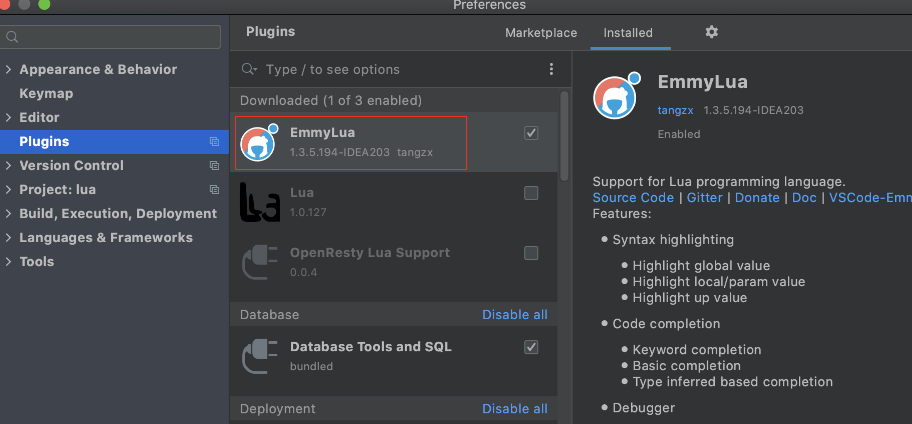
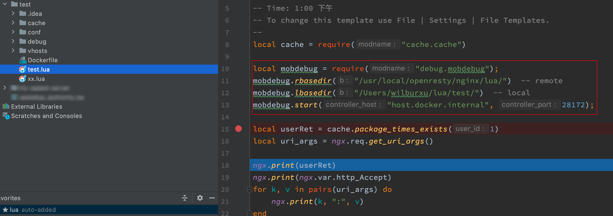
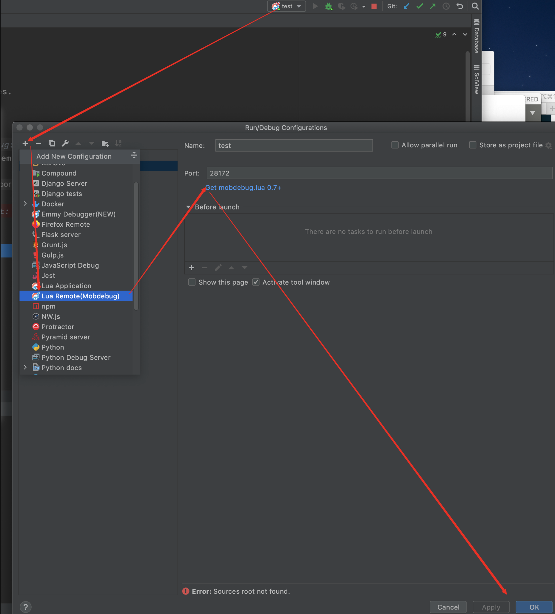

# lua远程调试 Remote Debug

## 日常的debug

当把一个本地项目部署到**远程测试服务器**后有可能出现意想不到错误，为了排查问题可能会变成：

这样：


然后这样：


最后就：


最可怕的是，由于堆栈的关系，很难在一次debug日志中拿到想要的信息，往往是一层层往下打日志，才能拿到想要的debug信息。


##  remote debug

本地服务器开放端口，将远程服务器的断点信息打到本地服务器。


### 那具体如何实现呢？

jetbrains的“EmmyLua”插件  + mobdebug库

#### 本地jetbrains增加EmmyLua插件安装



#### 远端服务器增加mobdebug包放到项目debug目录下，并增加配置信息

https://github.com/pkulchenko/MobDebug/blob/master/src/mobdebug.lua

```lua
local mobdebug = require("debug.mobdebug");
mobdebug.rbasedir("/usr/local/openresty/nginx/lua/")  -- remote
mobdebug.lbasedir("/Users/wilburxu/lua/test/")  -- local
mobdebug.start("host.docker.internal", 28172);
```




ps：断点信息发回的是远端服务器的line，所以本地服务器要保证和远端服务器的line一致。


#### 本地添加调试configuration




### 发送请求


就可以得到我们想要的堆栈信息了。

