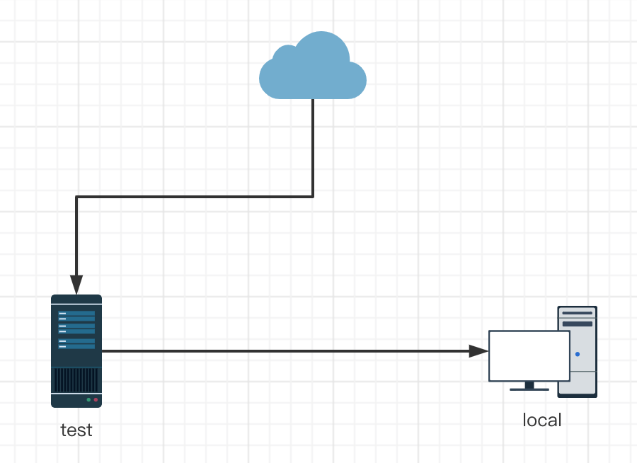

# lua远程调试 Remote Debug

## 日常的debug

当把一个本地项目部署到**远程测试服务器**后有可能出现意想不到错误，为了排查问题可能会变成：

这样：

然后这样：

最后就：

最可怕的是，由于堆栈的关系，很难在一次debug日志中拿到想要的信息，往往是一层层往下打日志，才能拿到想要的debug信息。

##  remote debug

本地服务器开放端口，将远程服务器的断点信息打到本地服务器。

就可以得到我们想要的堆栈信息了。

### 那具体如何实现呢？

jetbrains的“EmmyLua”插件  + mobdebug库

