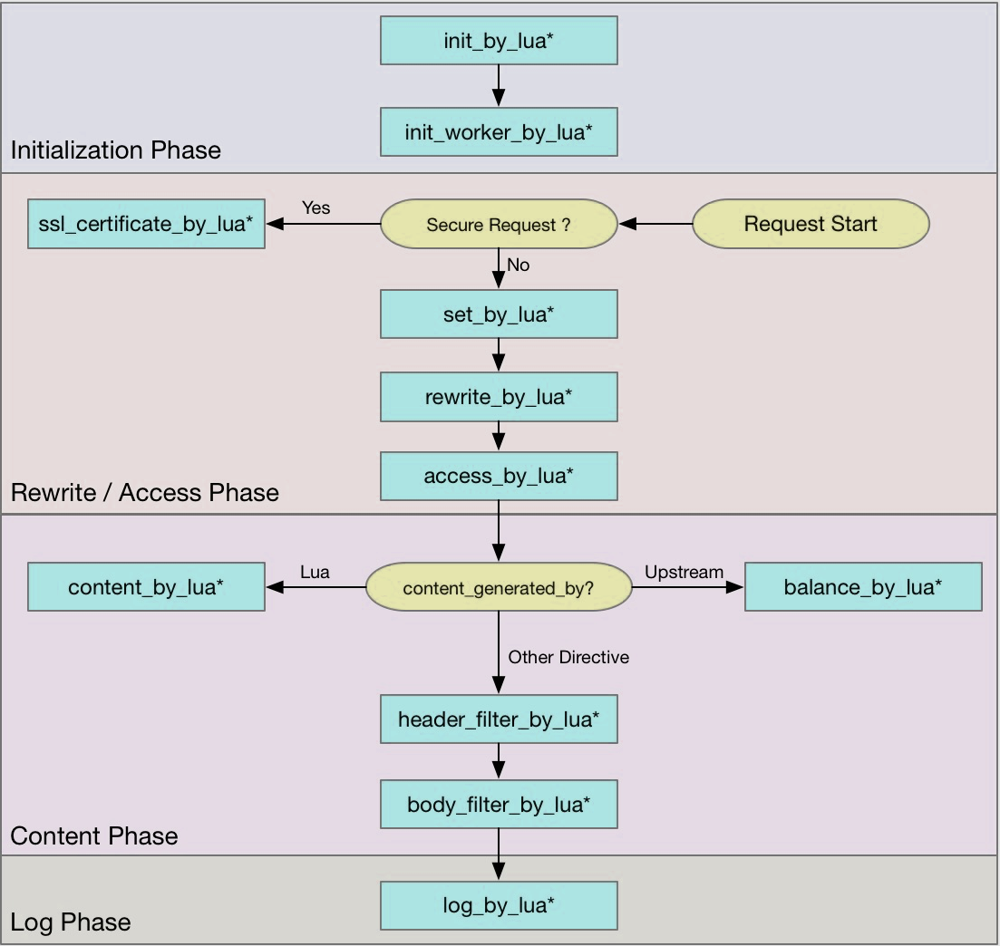

# Lua

Lua语言强大的原因之一就在于它的标准库，自动内存管理简化了接口的实现（无须关心内存的分配/释放及处理溢出），作为第一类值的函数支持高度的泛化，从而使得函数更加通用。

Lua语言除了是一门可扩展的语言外，还是一门胶水语言（glue language）。

Lua语言的大部分基础功能都是通过外部库实现的。我们可以很容易地将Lua与C/C++、Java、C#和Python等结合在一起使用。

## 架构

下图为Lua Nginx Module指令的执行顺序图，可以根据具体的业务场景设置不同的lua脚本。几个重要的部分：

- **init_by_lua、init_by_lua_block**: 运行在Nginx loading-config 阶段，注册Nginx Lua全局变量，和一些预加载模块。是Nginx master进程在加载Nginx配置时执行。
- **init_worker_by_lua**: 在Nginx starting-worker阶段，即每个nginx worker启动时会调用，通常用来hook worker进程，并创建worker进行的计时器，用来健康检查，或者设置熔断记时窗口等等。
- **access_by_lua**: 在**access tail**阶段，用来对每次请求做访问控制，权限校验等等，能拿到很多相关变量。例如：请求体中的值，header中的值，可以将值添加到**ngx.ctx**, 在其他模块进行相应的控制
- **balancer_by_lua**: 通过Lua设置不同的负载均衡策略, 具体可以参考[lua-resty-balancer](https://github.com/openresty/lua-resty-balancer)
- **content_by_lua**: 在content阶段，即**content handler**的角色，即对于每个api请求进行处理，注意不能与proxy_pass放在同一个location下
- **proxy_pass**: 真正发送请求的一部分, 通常介于**access_by_lua**和**log_by_lua**之间
- **header_filter_by_lua**:在**output-header-filter**阶段，通常用来重新响应头部，设置cookie等，也可以用来作熔断触发标记
- **body_filter_by_lua**:对于响应体的content进行过滤处理
- **log_by_lua**:记录日志即，记录一下整个请求的耗时，状态码等

## 常用命令

- **ngx.var.<arg>**, lua使用nginx内置的绑定变量. **ngx.var.remote_addr**为获取远程的地址，**ngx.var.http_cookie**获取cookie信息
- **ngx.ctx**: 每次请求的上下文，可以在ctx里记录，每次请求上下文的一些信息，例如：**request_id**, **access_key**等等
- **upstream** 块里的的**balancer_by_lua_file**, 使用**ngx.balancer**模块，可以实现不同的负载均衡策略，并调用**set_current_peer**函数设置当前query调用的backend
- 对Openresty写的网关，测试也至关重要，测试是基于perl的单元测试，包含了Nginx C model和OpenResty文档地址 [OpenResty Test guide](https://openresty.gitbooks.io/programming-openresty/content/)
- **ngx.shared.DICT dict = ngx.shared[name_var]** : 获取共享内存的lua dict. 且shared.DICT在当前nginx server实例中被所有nginx worker进程共享。
- **ngx.shared.DICT**当到达定义的大小限制时，再次调用set操作，会使用LRU淘汰一些key。set操作会返回三个值(success, err, forcible).
- **ngx.shared.DICT**支持过期操作，expire等等
- 对于ngx.shared.DICT的并发安全，使用**resty.lock**库进行加速控制
- **cosocket** 可以理解为**coroutine + socket**: 协程特性支撑 + nginx事件循环回调机制
- **ngx.timer.at(delay, callback, user_arg1)**为**cosocket** API，定时任务, 定时执行某些异步任务,即异步执行某些操作，不必等待结果返回时调用。例如：统计一段窗口期的请求耗时，发送通知管理员邮件的等等。 **ngx.timer.at**通过递归的方式，来实现每隔多长时间，执行某些操作。

## 协程（Coroutine）

1. 协程并非os线程，所以创建、切换开销比线程相对要小。 

2. 协程与线程一样有自己的栈、局部变量等，但是协程的栈是在用户进程空间模拟的，所以创建、切换开销很小。

3. 多线程程序是多个线程并发执行，也就是说在一瞬间有多个控制流在执行。而协程强调的是一种多个协程间协作的关系，只有当一个协程主动放弃执行权，另一个协程才能获得执行权，所以在某一瞬间，多个协程间只有一个在运行。 

4. 由于多个协程时只有一个在运行，所以对于临界区的访问不需要加锁，而多线程的情况则必须加锁。 

5. 多线程程序由于有多个控制流，所以程序的行为不可控，而多个协程的执行是由开发者定义的所以是可控的。 

Nginx的每个Worker进程都是在epoll或kqueue这样的事件模型之上，封装成协程，每个请求都有一个协程进行处理。这正好与Lua内建协程的模型是一致的，所以即使ngx_lua需要执行Lua，相对C有一定的开销，但依然能保证高并发能力。

