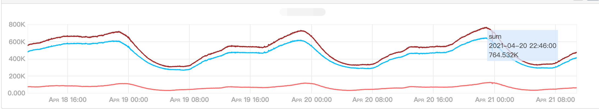
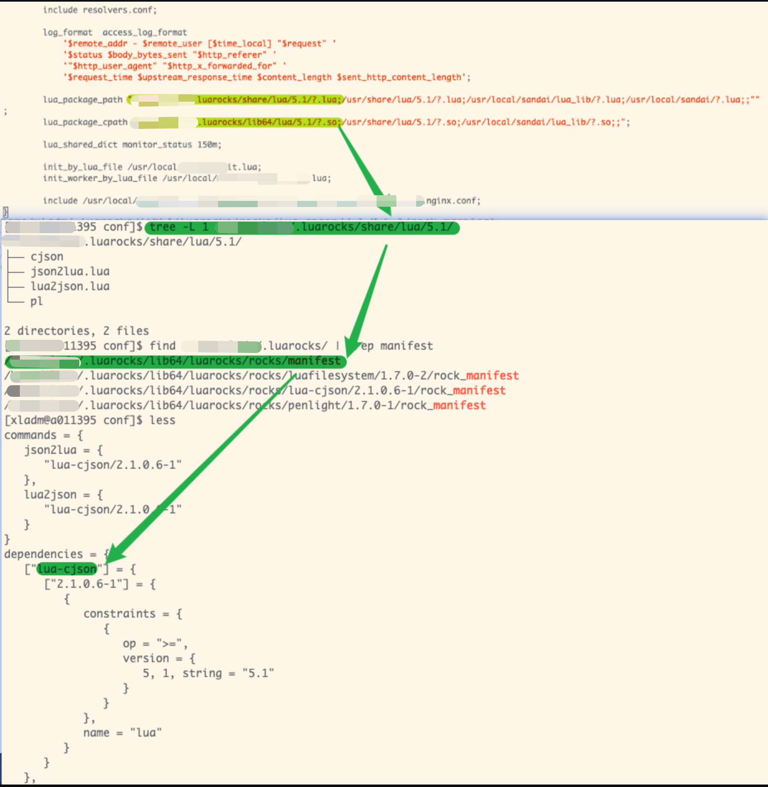
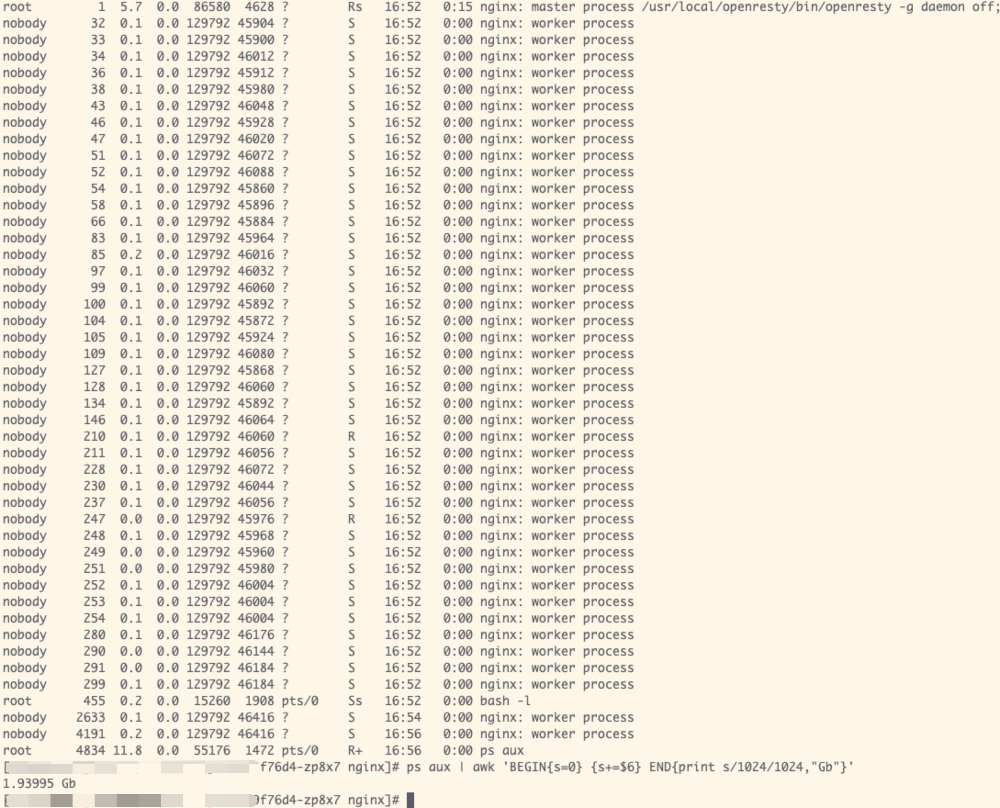
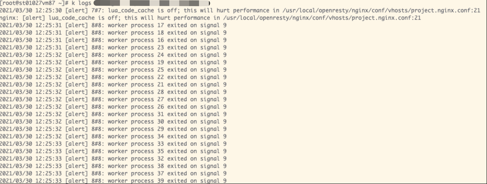

# Lua OpenResty容器化（考古历程）

## 背景

公司有几个“远古时期”的项目，一直都相对较为稳定，但是项目每天总会在一些时段，请求每分钟QPS到达峰值`800K`左右，导致机器的性能出现了一些瓶颈，每到峰值时期，总会出现一个告警，实在是令人头疼。更糟糕的是这只是远古时期项目中的其中一个而且都是部署在物理机器上，所有机器加起来接近100台。

出于稳定性（削峰）和成本的角度考虑，我们最终决定将所有的Lua OpenResty项目上到k8s集群。




## 选择合适的openresty基础镜像

通过查看线上在使用的openresty版本信息：

```shell
/usr/local/openresty/nginx/sbin/nginx -V
nginx version: openresty/1.13.6.2
built by gcc 4.8.5 20150623 (Red Hat 4.8.5-16) (GCC)
built with OpenSSL 1.1.0h  27 Mar 2018 (running with OpenSSL 1.1.0k  28 May 2019)
TLS SNI support enabled
configure arguments: --prefix=/usr/local/openresty/nginx ...
```

```shell
lua -v
Lua 5.1.4  Copyright (C) 1994-2008 Lua.org, PUC-Rio
```

得知在使用的是`openresty/1.13.6.2`和`Lua 5.1.4 ` :

```shell
docker pull openresty/openresty:1.13.6.2-2-centos
```


Q：能不能选择使用更小的alpine系列的呢？

A：因为项目依赖许多的so库，都是`glibc`编译的，alpine的话是`musl-lib`，不兼容。

Q：为啥不重新编译？

A：一方面是风险问题，另外一方面是有一些so库不一定能找到。


## 查找项目的动态库依赖关系

### Nginx配置文件

```shell
$ tree -L 3 nginx/conf
nginx/conf
├── vhosts/
│    ├── inner.prometheus.nginx.conf
│    └── project.nginx.conf
└── nginx.conf
```


### 自编译的C动态库文件，如`binary_protocol.so`

编写好dockerfile，然后将项目打包进容器，执行：

```shell
/usr/local/openresty/nginx/sbin/nginx nginx -t
```

果不其然，报错：

```shell
/usr/local/openresty/nginx/lua/init.lua:1: module 'binary_protocol' not found:
no field package.preload['binary_protocol']
no file '/usr/local/openresty/nginx/lua/binary_protocol.lua'
no file '/usr/local/openresty/nginx/lua_lib/binary_protocol.lua'
no file '/usr/local/openresty/nginx/luarocks/share/lua/5.1/binary_protocol.lua'
no file '/usr/local/openresty/site/lualib/binary_protocol.ljbc'
…… ……
no file '/usr/local/openresty/nginx/luarocks/lib64/lua/5.1/binary_protocol.so'
no file '/usr/local/openresty/site/lualib/binary_protocol.so'
no file '/usr/local/openresty/lualib/binary_protocol.so'
no file '/usr/local/openresty/site/lualib/binary_protocol.so'
no file '/usr/local/openresty/lualib/binary_protocol.so'
no file './binary_protocol.so'
no file '/usr/local/lib/lua/5.1/binary_protocol.so'
no file '/usr/local/openresty/luajit/lib/lua/5.1/binary_protocol.so'
no file '/usr/local/lib/lua/5.1/loadall.so'
no file '/usr/local/openresty/luajit/lib/lua/5.1/binary_protocol.so'
```

Q：仔细观察，发现so动态库是内部编译出来提供给lua调用的，如何找到它们呢？

A：是[ldd](https://man7.org/linux/man-pages/man1/ldd.1.html)、[pldd](https://man7.org/linux/man-pages/man1/pldd.1.html)又或者使用[lsof](https://man7.org/linux/man-pages/man8/lsof.8.html)查看动态库文件。

通过ldd、pldd命令，可以查看so所相关的依赖

```shell
ldd binary_protocol.so
linux-vdso.so.1 =>  (0x00007fff40bd4000)
libtolua++.so => not found		## 会告诉我们ldd缺少这个依赖
libcrypto.so.6 => not found
liblog4cplus.so.2 => not found		
libstdc++.so.6 => /lib64/libstdc++.so.6 (0x00007f458d9ef000)
libm.so.6 => /lib64/libm.so.6 (0x00007f458d6ed000)
libgcc_s.so.1 => /lib64/libgcc_s.so.1 (0x00007f458d4d7000)
libc.so.6 => /lib64/libc.so.6 (0x00007f458d10a000)
/lib64/ld-linux-x86-64.so.2 (0x00007f458df1e000)
```

通过这些方法，一点点跟踪，知道找齐所有依赖库即可。


### Luarocks外部包文件

从线上的`nginx.conf`找到`lua_package_path`和`lua_package_cpath`中包括的`luarocks`路径，再从这个路径中，找到`manifest`文件，此文件有描述安装了哪些luarocks库。




#### luarocks 外部依赖安装

```dockerfile
RUN luarocks --tree=${WORK_DIR}/luarocks install lua-cjson \
    && luarocks --tree=${WORK_DIR}/luarocks install penlight \
    && luarocks --tree=${WORK_DIR}/luarocks install version \
    && luarocks --tree=${WORK_DIR}/luarocks install lua-resty-http \
    && luarocks --tree=${WORK_DIR}/luarocks install luaunit \
    && luarocks --tree=${WORK_DIR}/luarocks install ldoc \
    && luarocks --tree=${WORK_DIR}/luarocks install lua-discount \
    && luarocks --tree=${WORK_DIR}/luarocks install serpent \
    && luarocks --tree=${WORK_DIR}/luarocks install luacov \
    && luarocks --tree=${WORK_DIR}/luarocks install cluacov \
    && luarocks --tree=${WORK_DIR}/luarocks install mmdblua \
    && luarocks --tree=${WORK_DIR}/luarocks install lua-resty-jit-uuid \
    && luarocks --tree=${WORK_DIR}/luarocks install luasocket

RUN luarocks --tree=/usr/local/openresty/nginx/luarocks install nginx-lua-prometheus
```


## 遇到的问题及其解决方法

### 问题1：容器老被OOM Killed

经过分析，的确占用了非常大的内存：



通过ps命令定位到 worker 数量非常多

解决方法：

限定worker数量：`worker_processes 4;`


Q：为啥会产生这么多worker？

A：在k8s上，nginx 启动的 worker process，并没有遵循我们给 Pod 设置的 limit，而是与 Pod 所在 node 有关。


### 问题2：nginx worker process exited on signal 9



是由于Deployment设定的内存限额太小所致

解决方法：调大`requests`资源限额

```yaml
resources:
  limits:
  	cpu: "2000m"
  	memory: "1Gi"
  requests:
  	cpu: "1000m"
  	memory: "512Mi"
```

ps：启动4个Worker大约消耗200Mi。


### 问题3：attempt to index upvalue ‘result_dict’ (a nil value)

原因是线上的nginx.conf有相关的定义
而代码层面上没有，加上即可：

```nginx
lua_shared_dict monitor_status 150m;
```


## 缩减镜像大小的一个小技巧

[借鸡生蛋](https://github.com/WilburXu/blog/blob/master/docker/use%20multi-stage%20builds.md)


## 如何接入Prometheus监控

在OpenResty中接入 Prometheus，https://github.com/knyar/nginx-lua-prometheus

### 安装依赖

```shell
luarocks --tree=/usr/local/openresty/nginx/luarocks install nginx-lua-prometheus
```


### 新增配置

为`nginx/conf/vhosts/project.nginx.conf`增加：

```nginx
lua_shared_dict prometheus_metrics 10M;
log_by_lua_block {
    metric_requests:inc(1, {ngx.var.server_name, ngx.var.status})
    metric_latency:observe(tonumber(ngx.var.request_time), {ngx.var.server_name})
}
```


### 新增配置文件

新增`nginx/conf/vhosts/inner.prometheus.nginx.conf`

```nginx
server {
    listen 8099;
    location /metrics {
        content_by_lua_block {
            metric_connections:set(ngx.var.connections_reading, {"reading"})
            metric_connections:set(ngx.var.connections_waiting, {"waiting"})
            metric_connections:set(ngx.var.connections_writing, {"writing"})
            prometheus:collect()
        }
    }
}
```


### 更新deployment配置

```yaml
apiVersion: extensions/v1beta1
kind: Deployment
metadata:
  name: ${name}
  namespace: ${namespace}
  labels:
    test-app: test-server
spec:
  replicas: ${replicas}
  template:
    metadata:
      labels:
        test-app: test-server
      annotations: # <----------------------- 新增
        prometheus.io/scrape: "true"
        prometheus.io/path: "/metrics"
        prometheus.io/port: "8099"
```


## 总结

至此，lua的一个项目容器化完成，中途遇到的问题还是蛮多的，上面也只记录了几个主要的步骤和问题。


