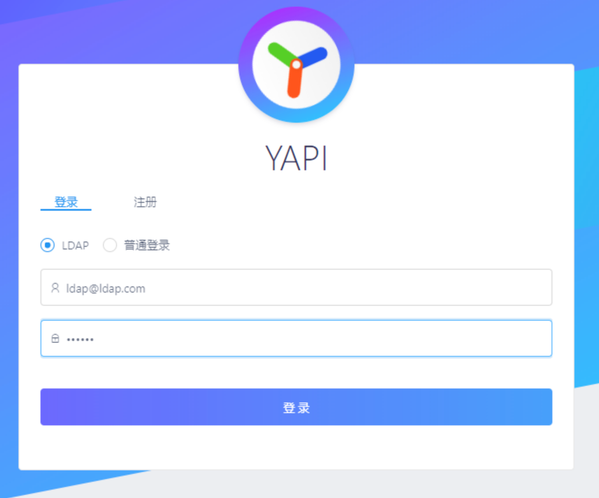
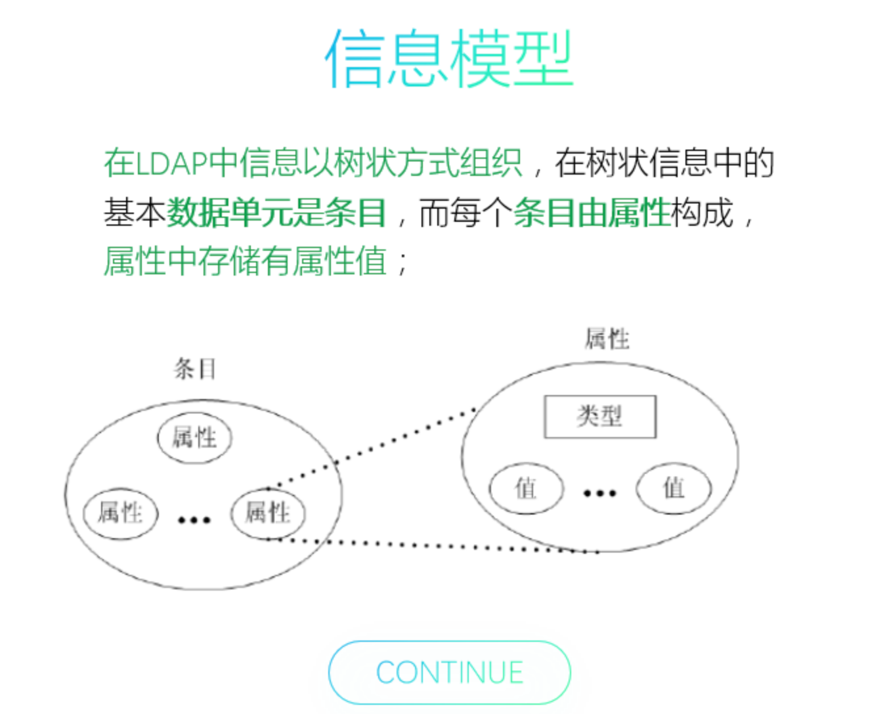
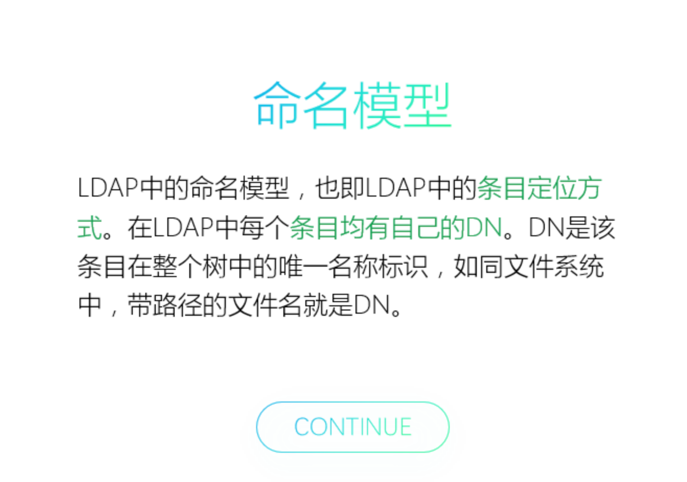
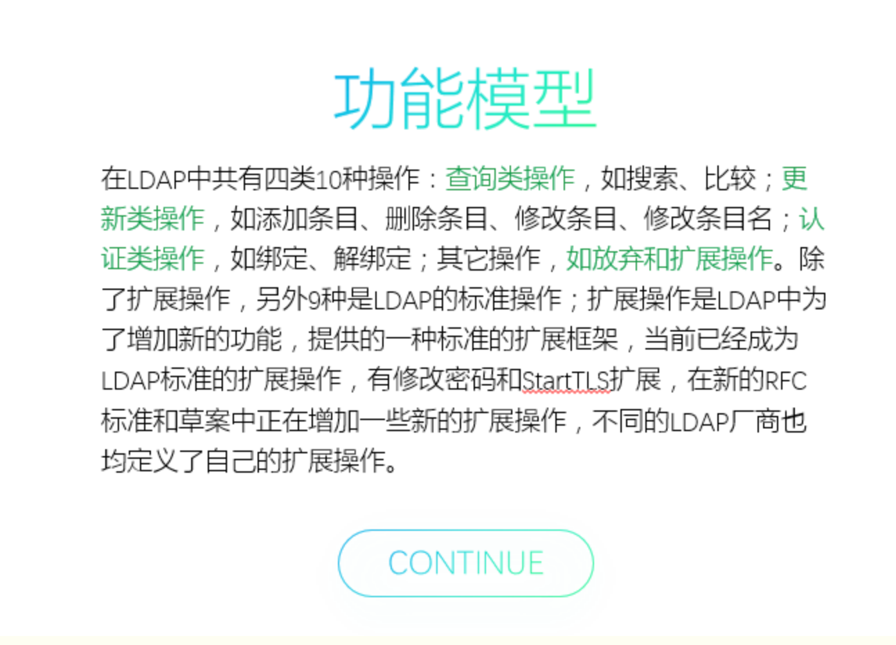
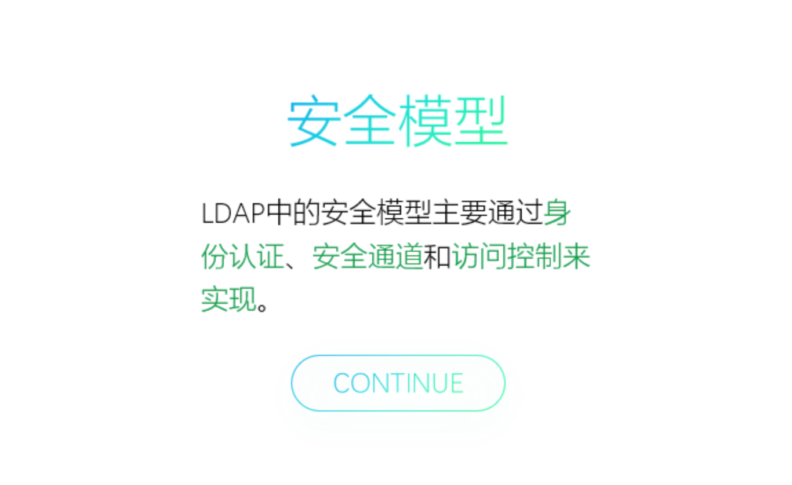
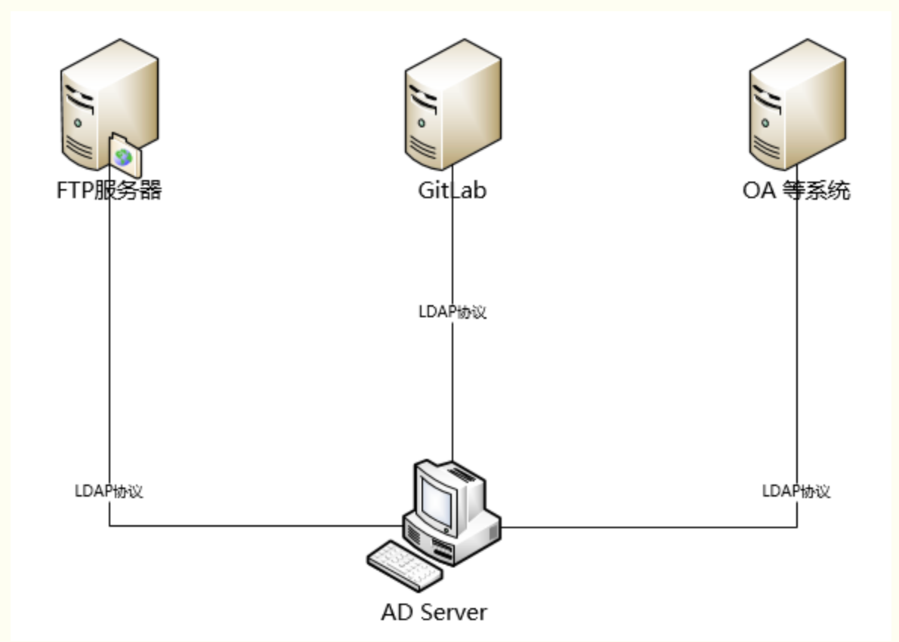

# LDAP概念和原理介绍

信对于许多的朋友来说，可能听说过LDAP，但是实际中对LDAP的了解和具体的原理可能还比较模糊，今天就从“什么是LDAP”、“LDAP的主要产品”、“LDAP的基本模型”、“LDAP的使用案例”四个方面来做一个介绍。

我们在开始介绍之前先来看几个问题：

1. 我们日常的办公系统是不是有多个？

2. 每个系统之间是不是都有独立的账号密码？

3. 密码多了，有时候半天想不起来哪个密码对应哪个系统？

4. 每次新项目的开发，都需要重新开发和维护一套用户密码？

5. 维护多套系统的用户是不是非常头疼？

So，如今大家再也不用为上面的的问题头疼了，因为“LDAP统一认证服务”已经帮助大家解决这些问题了。那么相信大家对“LDAP统一认证服务”是干嘛的已经有一个大概的了解了吧？那我们开始今天要讲解的内容吧！


## 一、什么是LDAP？

### （一）在介绍什么是LDAP之前，我们先来复习一个东西：“什么是目录服务？”

1. 目录服务是一个特殊的数据库，用来保存描述性的、基于属性的详细信息，支持过滤功能。

2. 是动态的，灵活的，易扩展的。

如：人员组织管理，电话簿，地址簿。


### （二）了解完目录服务后，我们再来看看LDAP的介绍

LDAP（Light Directory Access Portocol），它是基于`X.500标准`的轻量级目录访问协议。

目录是一个为`查询`、`浏览`和`搜索而`优化的数据库，它成`树状结构组织数据`，类似文件目录一样。

目录数据库和关系数据库不同，它有`优异的读性能`，但`写性能差`，并且没有事务处理、回滚等复杂功能，不适于存储修改频繁的数据。所以目录天生是用来查询的，就好象它的名字一样。

LDAP目录服务是由目录数据库和一套访问协议组成的系统。


### （三）为什么要使用？

LDAP是开放的Internet标准，支持跨平台的Internet协议，在业界中得到广泛认可的，并且市场上或者开源社区上的大多产品都加入了对LDAP的支持，因此对于这类系统，不需单独定制，只需要通过LDAP做简单的配置就可以与服务器做认证交互。“简单粗暴”，可以大大降低重复开发和对接的成本。


我们拿开源系统（YAPI）做案例，只需做一下简单的几步配置就可以达到LDAP的单点登录认证了：

```json
{
"ldapLogin": {
      "enable": true,
      "server": "ldap://l-ldapt1.ops.dev.cn0.qunar.com",
      "baseDn": "CN=Admin,CN=Users,DC=test,DC=com",
      "bindPassword": "password123",
      "searchDn": "OU=UserContainer,DC=test,DC=com",
      "searchStandard": "mail"
   }
}
```




是不是很方便呢？


## 二、LDAP的主要产品

细心的朋友应该会主要到，LDAP的中文全称是：轻量级目录访问协议，说到底LDAP仅仅是一个访问协议，那么我们的数据究竟存储在哪里呢？

来，我们一起看下下面的表格：

| 厂商       | 产品                       | 介绍                                                         |
| ---------- | -------------------------- | ------------------------------------------------------------ |
| SUN        | SUNONE Directory Server    | 基于文本数据库的存储，速度快 。                              |
| IBM        | IBM Directory Server       | 基于DB2 的的数据库，速度一般。                               |
| Novell     | Novell Directory Server    | 基于文本数据库的存储，速度快, 不常用到。                     |
| Microsoft  | Microsoft Active Directory | 基于WINDOWS系统用户，对大数据量处理速度一般，但维护容易，生态圈大，管理相对简单。 |
| Opensource | Opensource                 | OpenLDAP 开源的项目，速度很快，但是非主 流应用。             |

没错，这就是正常存储数据的地方，而访问这些数据就是通过我们上述所说的LDAP。相信到这里大家应该了解两者之间的关系了吧！


## 三、LDAP的基本模型

每一个系统、协议都会有属于自己的模型，LDAP也不例外，在了解LDAP的基本模型之前我们需要先了解几个LDAP的目录树概念：

### （一）目录树概念

1. 目录树：在一个目录服务系统中，整个目录信息集可以表示为一个目录信息树，树中的每个节点是一个条目。

2. 条目：每个条目就是一条记录，每个条目有自己的唯一可区别的名称（DN）。

3. 对象类：与某个实体类型对应的一组属性，对象类是可以继承的，这样父类的必须属性也会被继承下来。

4. 属性：描述条目的某个方面的信息，一个属性由一个属性类型和一个或多个属性值组成，属性有必须属性和非必须属性。

   

### （二）DC、UID、OU、CN、SN、DN、RDN

| **关键字** | **英文全称**       | **含义**                                                     |
| ---------- | ------------------ | ------------------------------------------------------------ |
| **dc**     | Domain Component   | 域名的部分，其格式是将完整的域名分成几部分，如域名为example.com变成dc=example,dc=com（一条记录的所属位置） |
| **uid**    | User Id            | 用户ID songtao.xu（一条记录的ID）                            |
| **ou**     | Organization Unit  | 组织单位，组织单位可以包含其他各种对象（包括其他组织单元），如“oa组”（一条记录的所属组织） |
| **cn**     | Common Name        | 公共名称，如“Thomas Johansson”（一条记录的名称）             |
| **sn**     | Surname            | 姓，如“许”                                                   |
| **dn**     | Distinguished Name | “uid=songtao.xu,ou=oa组,dc=example,dc=com”，一条记录的位置（唯一） |
| **rdn**    | Relative dn        | 相对辨别名，类似于文件系统中的相对路径，它是与目录树结构无关的部分，如“uid=tom”或“cn= Thomas Johansson” |


### （三）基本模型

#### 1. 信息模型



#### 2. 命名模型



#### 3. 功能模型




#### 4.  安全模型



## 四、LDAP的使用

　　那我们是如何访问LDAP的数据库服务器呢？




统一身份认证主要是改变原有的认证策略，使需要认证的软件都通过LDAP进行认证，在统一身份认证之后，用户的所有信息都存储在AD Server中。终端用户在需要使用公司内部服务的时候，都需要通过AD服务器的认证。

那么程序中是如何访问的呢？ 我们以PHP脚本作为例子：

```php
$ldapconn = ldap_connect(“10.1.8.78")
$ldapbind = ldap_bind($ldapconn, 'username', $ldappass);
$searchRows= ldap_search($ldapconn, $basedn, "(cn=*)");
$searchResult = ldap_get_entries($ldapconn, $searchRows);
ldap_close($ldapconn);
```

1. 连接到LDAP服务器；

2. 绑定到LDAP服务器；

3. 在LDAP服务器上执行所需的任何操作；

4. 释放LDAP服务器的连接；

 


